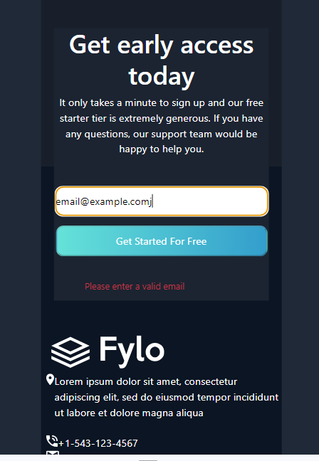

# Frontend Mentor - Fylo dark theme landing page solution

This is a solution to the [Fylo dark theme landing page challenge on Frontend Mentor](https://www.frontendmentor.io/challenges/fylo-dark-theme-landing-page-5ca5f2d21e82137ec91a50fd). Frontend Mentor challenges help you improve your coding skills by building realistic projects. 

## Table of contents

- [Overview](#overview)
  - [The challenge](#the-challenge)
  - [Screenshot](#screenshot)
  - [Links](#links)
- [My process](#my-process)
  - [Built with](#built-with)
  - [What I learned](#what-i-learned)
  - [Continued development](#continued-development)
  - [Useful resources](#useful-resources)
- [Author](#author)

## Overview

### The challenge

Users should be able to:

- View the optimal layout for the site depending on their device's screen size
- See hover states for all interactive elements on the page

### Screenshot



### Links

- Solution URL: [Github](https://github.com/cmb347827/fylo-dark-theme-landing-page-master)
- Live Site URL: [Live Github](https://cmb347827.github.io/fylo-dark-theme-landing-page-master/)

## My process

### Built with

- Semantic HTML5 markup
- Bootstrap
- Sass/SCSS
- Mobile-first workflow


### What I learned

- I had the most trouble applying both the partial background color and the background image.
  As the background color above the background image was a different color from the background color below the background 
  image , this became quite tricky.
  I first tried using the shorthand notation applied to the main element:
  ```
    background: map-get($colors,Dark BlueMain) url(./images/bg-curvy-mobile.svg) 50% 50%/100% 100% no-repeat;
  ```
  But that just caused the entire main background color to change to Dark BlueMain , above and below the background image.
- Then I found a stackoverflow post explaining how to add different colors above and below a background image. And finally after a lot of trial and error arrived at this code
  `background:url(./images/bg-curvy-desktop.svg)50% 30%/100% 20% no-repeat,linear-gradient(to bottom,hsl(217, 28%, 15%),hsl(217, 28%, 15%) 50%,#181F2B 50%,#181F2B 85%)0% 0%/100% 85% repeat;`
- I was also able to re-use Javascript code from a previous frontendmentor project (newsletter-sign-up-with-success-message-main junior project)


### Continued development

- Daily tutorials and projects in HTML5, CSS3, Javascript, Bootstrap, Sass/SCSS, some jQuery. For now, in time I will go re-learn React ect.


###useful-resources

[How to add background color to only a part of an element](https://stackoverflow.com/questions/17353449/i-want-to-add-a-background-color-only-to-part-of-my-div) <br>

[How do I combine background image and linear-gradient on the same element](https://stackoverflow.com/questions/2504071/how-do-i-combine-a-background-image-and-css3-gradient-on-the-same-element)

## Author

- Website - [One of my latest codepens](https://codepen.io/cynthiab72/pen/oNybYON)
- Frontend Mentor - [@cmb347827](https://www.frontendmentor.io/profile/cmb347827)
